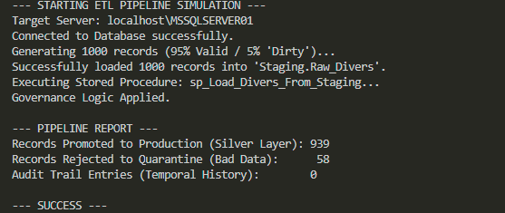

# Enterprise Data Governance & Integrity Pipeline


## Project Overview
This project implements a production-grade **Data Governance Pipeline** for a high-volume Dive Management Platform. Unlike standard CRUD applications, this architecture focuses on **Data Integrity, Security (GDPR), and Auditability**.

It simulates a real-world ingestion scenario where "dirty" external data is validated, cleaned, and promoted through a **Bronze (Staging) → Silver (Production)** architecture using SQL Server and Python.

## Architecture
* **Ingestion Layer:** A Python script generates synthetic datasets (using `Faker`) and pushes raw JSON-like data into a **Staging Schema**.
* **Governance Layer:** Stored Procedures act as "Gatekeepers," enforcing rigorous data quality constraints (Email validation, Age checks, De-duplication).
    * *Valid Data* -> Promoted to Production (`dbo.Diver`).
    * *Invalid Data* -> Rejected to (`dbo.Data_Quarantine`) for manual review.
* **Security Layer:** Implements **Dynamic Data Masking (DDM)** to protect PII (Personally Identifiable Information) from unauthorized query access.
* **Audit Layer:** Utilizes **System-Versioned Temporal Tables** to maintain an immutable, point-in-time history of all record changes for forensic compliance.

## Key Technical Features
| Feature | Implementation | Business Value |
| :--- | :--- | :--- |
| **Audit Compliance** | Temporal Tables (System Versioning) | Allows "Time Travel" queries to see data state at any past microsecond. |
| **Data Privacy** | Dynamic Data Masking | Hides sensitive PII (Emails/Phones) from analysts without breaking queries. |
| **Idempotency** | CTE & `ROW_NUMBER()` | Prevents pipeline crashes by automatically handling in-batch duplicates. |
| **Quality Gates** | Stored Procedures | Ensures 100% of production data meets business rules (Constraint Enforcement). |

## How to Run
1.  **Database Setup:** Execute scripts `01` through `06` in the `sql_scripts/` folder to build the schema, enable versioning, and seed static data.
2.  **Run ETL:** Execute the Python driver to generate 1,000 synthetic records and trigger the pipeline.
    ```bash
    python python_etl/data_generator.py
    ```
3.  **Verify Governance:**
    * Check `dbo.Diver` for clean data.
    * Check `dbo.Data_Quarantine` to see rejected records.
    * Run an UPDATE on any diver to see `dbo.Diver_History` capture the previous state automatically.

## Tech Stack
* **Database:** Microsoft SQL Server 2022 (Developer Edition)
* **Language:** T-SQL, Python 3.x
* **Libraries:** `pyodbc`, `faker`

## Demo Output
* Demo Output when run locally:
  

